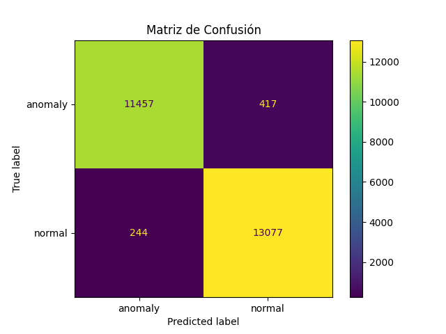

# Introducción
Este proyecto representa lo que ha sido mi aprendizaje sobre los modelos de clasificación binaria en los últimos días. He elegido un dataset que contiene información acerca de transacciones bancarias, clasificadas en legítimas o fraudulentas.
- **Link del dataset**: [Dataset de Kaggle](https://www.kaggle.com/datasets/hassan06/nslkdd)

# Tech Stack
- **Python**: La versión utilizada en este proyecto es la 3.11.3.
- **Scikit-learn**
- **Pandas**
- **Numpy**
- **Matplotlib**

# Características
El modelo de Regresión Logística o de Clasificación permite predecir si una transacción es fraudulenta o no, basado en una serie de atributos de entrada. Este enfoque proporciona una forma efectiva de identificar patrones asociados con el fraude.

# Proceso
Empecé el proyecto profundizando en los modelos de clasificación, queriendo entender más a detalle cómo funcionan desde el punto de vista matemático. Durante esta investigación, me encontré con conceptos tan interesantes como la función sigmoide, que es crucial para la regresión logística. También aprendí acerca de la evaluación de los modelos, algo que considero muy importante para medir el rendimiento de los mismos. Estos conocimientos me permitieron desarrollar y evaluar mi modelo de manera efectiva, asegurándome de que cumpliera con los objetivos del proyecto.

# Aprendizajes
Durante este proyecto realmente aprendí bastantes cosas, dentro de las que quiero destacar se encuentran:
1. **Los fundamentos matemáticos y estadísticos de la Regresión Logística**
2. **Manejo y preparación de datos categóricos y numéricos**
3. **Evaluación de modelos de clasificación**
4. **Importancia del feature engineering**
5. **Métricas de desempeño para modelos de clasificación, como el F1 Score y la Matriz de Confusión**

# Mejoras
Siendo este mi segundo proyecto de Data Science y Machine Learning, reconozco que hay múltiples áreas en las que puedo mejorar. Estoy abierto a cualquier tipo de consejo o sugerencia que me puedan brindar para seguir aprendiendo y mejorando mis habilidades en este campo. Gracias de antemano por su apoyo y orientación.

# Pasos para Inicializar el Proyecto

1. **Instalar los paquetes:**
    ```sh
    pip install
    `

2. **Ubicarse en la carpeta src:**
    ```sh
    cd src
    ```

3. **Ejecutar el archivo para transformar el conjunto de datos:**
    ```sh
    python .\data_transformer.py
    ```

4. **Entrenar el modelo:**
    ```sh
    python .\model_builder.py
    ```

5. **Realizar pruebas y evaluar al modelo:**
    ```sh
    python .\model_evaluator.py
    ```


